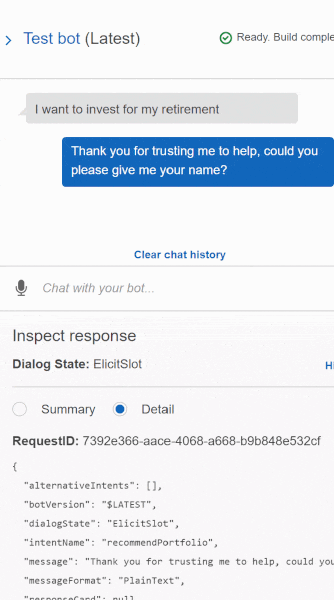
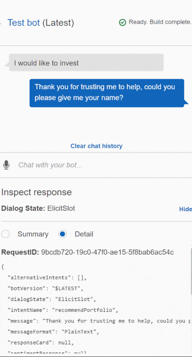

# aws_investment_bot

This is a AWS Lex chatbot lambda function which is used to verify user inputs and to output an appropriate response based on those user inputs. It will output which portfolio strategy is best for the user.

---

## Technologies

This project uses python 3.7 for the lambda function and AWS Lex to create a chat bot.

---

## Usage

Below are two gifs of the Lex Chatbot:
Chatbot without Lambda function:

Chatbot using the Lambda function:

---

## Contributors

Deep Patel -- Deep4Patel9@gmail.com

---

## License

MIT License
